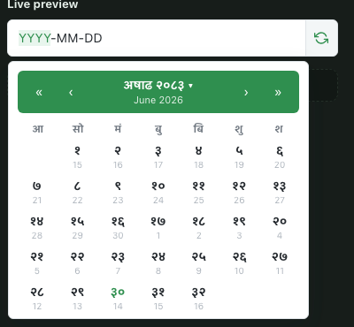
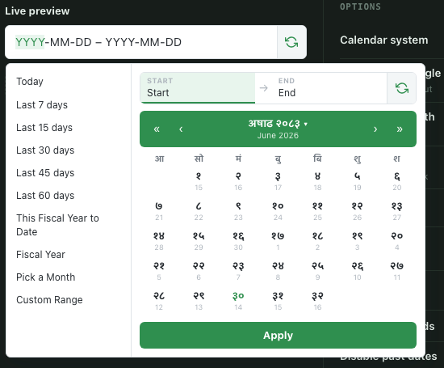
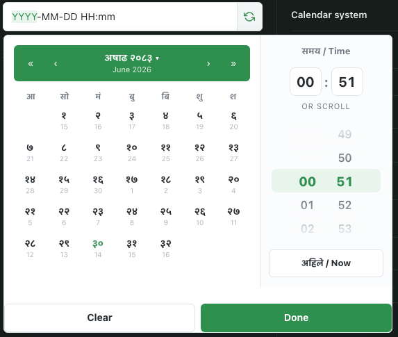
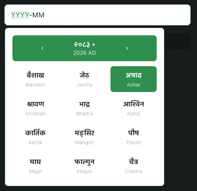

# nepali-datepicker-pro

[](https://www.npmjs.com/package/nepali-datepicker-pro)
[](https://www.npmjs.com/package/nepali-datepicker-pro)
[](https://bundlephobia.com/package/nepali-datepicker-pro)
[](./LICENSE)
[](https://www.typescriptlang.org/)

A **framework-agnostic** Bikram Sambat (BS) ↔ Gregorian (AD) date picker, with a same-screen time picker, a range picker, and a month picker — built for real production forms, not just demos.

Zero runtime dependencies. Works from plain `<script>` tags, jQuery, Vue 3, and React — same core, five entry points.

```
📅 Date & Time   —  BS/AD toggle, 12h/24h wheel time picker, keyboard-editable input
📆 Date Range    —  presets rail, fiscal-year helpers, min/max span
🗓️  Month         —  pick a BS month, get the AD start/end range for reporting
```
## Date Picker

<table>
  <tr>
    <td align="center">
      
      <br><strong>Date Picker</strong>
    </td>
    <td align="center">
      
      <br><strong>Date Range Picker</strong>
    </td>
  </tr>
  <tr>
    <td align="center">
      
      <br><strong>Date Time Picker</strong>
    </td>
    <td align="center">
      
      <br><strong>Month Picker</strong>
    </td>
  </tr>
</table>
---

## Table of contents

- [Why this exists](#why-this-exists)
- [Features](#features)
- [Install](#install)
- [Quick start](#quick-start)
  - [Vanilla JS](#vanilla-js)
  - [HTML / `<script>` tag](#html--script-tag)
  - [React](#react)
  - [Vue 3](#vue-3)
  - [jQuery](#jquery)
- [Pickers](#pickers)
  - [`NepaliDateTimePicker`](#nepalidatetimepicker)
  - [`NepaliDateRangePicker`](#nepalidaterangepicker)
  - [`NepaliMonthPicker`](#nepalimonthpicker)
- [Sending the right value to your backend](#sending-the-right-value-to-your-backend)
- [Shared options](#shared-options)
- [Events](#events)
- [Styling](#styling)
- [TypeScript](#typescript)
- [Browser support](#browser-support)
- [Contributing](#contributing)
- [License](#license)
- Full documentation, with live configurable demos: **<https://nepali-datepicker-pro.vercel.app/>**
- Further reading: [quick start](./docs/guide/quick-start.md) · [options](./docs/guide/options.md) · [migration](./docs/guide/migration.md)

---

## Why this exists

Most "Nepali date picker" packages on npm are jQuery plugins from 2016, ship no types, hard-code the display format, and give you no sane way to actually get an AD date back to your server. This package was built to solve that properly:

- **One conversion engine, five bindings.** The BS↔AD math lives once in the core; React/Vue/jQuery/vanilla are thin wrappers, so behavior never drifts between frameworks.
- **The value you *display* is never assumed to be the value you *submit*.** `valueFormat`, `submitName`, and `altField` exist specifically so a BS-mode picker can still hand your Laravel/Express backend a clean AD ISO string without you writing conversion glue.
- **Accessible by default.** Segmented, keyboard-editable inputs (arrow keys to step, digits to type, Nepali or ASCII numerals) instead of a read-only trap that forces a mouse.
- **No dependencies.** No dayjs, no moment, no jQuery required unless you're using the jQuery binding.

---

## Features

- 🔁 **BS ⇄ AD mode toggle** — per-instance, with a swap button on the input (`allowModeToggle`)
- 🕐 **Same-screen time picker** — 12h/24h, minute-step control, min/max hour clamping, disabled times
- 📏 **Date range picker** — presets rail (incl. "Pick a Month"), configurable Nepali **fiscal year** start month, auto-apply, max span
- 🗓️ **Month picker** — returns the full AD `{ start, end }` range for the selected BS month, ideal for payroll/report filters
- 🌐 **Locale-aware** — Nepali (`ne`) or English (`en`) digits and month names
- 🚫 **Disabling** — `minDate`/`maxDate` (absolute or relative, e.g. `'+7d'`), `disabledWeekdays`, `disabledDates(date) => boolean`
- 🎯 **Decoupled machine value** — `valueFormat: 'iso' | 'iso-bs' | 'timestamp'`, plus `submitName` / `altField` to wire straight into a native `<form>` POST
- ⌨️ **Keyboard-editable, masked inputs** — no read-only trap; type or arrow-key through segments
- 🖼️ **Portal-based popup** — `appendTo`, `opens`, `drops` for layout-safe positioning inside modals/tables
- 🧩 **Five entry points** — `vanilla`, `/react`, `/vue`, `/jquery`, and a UMD build for a plain `<script>` tag
- 📦 **Tree-shakeable ESM** + CJS/UMD fallback, full `.d.ts` types, single CSS file

---

## Install

```bash
npm install nepali-datepicker-pro
# or
pnpm add nepali-datepicker-pro
# or
yarn add nepali-datepicker-pro
```

React and Vue are **optional peer dependencies** — only required if you import `nepali-datepicker-pro/react` or `nepali-datepicker-pro/vue`. The vanilla/UMD/jQuery bindings pull in nothing extra.

Don't forget the stylesheet, once, anywhere in your app:

```ts
import 'nepali-datepicker-pro/style.css';
```

---

## Quick start

### Vanilla JS

```ts
import { mountDateTimePicker } from 'nepali-datepicker-pro';
import 'nepali-datepicker-pro/style.css';

mountDateTimePicker(document.querySelector('#picker'), {
  mode: 'BS',
  withTime: true,
  valueFormat: 'iso',
  onChange: (result) => console.log(result.formatted, result.value),
});
```

### HTML / `<script>` tag

No build step required — good for a legacy Blade/PHP page or a CMS.

```html
<link rel="stylesheet" href="https://unpkg.com/nepali-datepicker-pro/dist/style.css">
<script src="https://unpkg.com/nepali-datepicker-pro/dist/nepali-datepicker-pro.umd.cjs"></script>

<input data-nepali-datepicker data-with-time="true" data-value-format="iso" readonly>
<script>NepaliPicker.autoInit()</script>
```

> `data-*` auto-init only covers the options listed in each picker's "HTML attrs" column below. Anything else (callbacks, `disabledDates`, etc.) needs the JS API.

### React

All three React components accept every picker option as a **prop** — no options wrapper object needed. Callbacks like `onChange` are stable across renders and never go stale, so you can pass an inline arrow function without triggering unnecessary updates.

```tsx
import { NepaliDateTimePicker, NepaliDateRangePicker, NepaliMonthPicker } from 'nepali-datepicker-pro/react';
import 'nepali-datepicker-pro/style.css';

// Single date + time
function AppointmentForm() {
  return (
    <NepaliDateTimePicker
      withTime
      valueFormat="iso"
      submitName="appointment_date"
      onChange={(result) => console.log(result)}
    />
  );
}

// Date range
function ReportFilter() {
  return (
    <NepaliDateRangePicker
      mode="BS"
      numberOfMonths={2}
      onApply={(result) => console.log(result.startValue, result.endValue)}
    />
  );
}

// Month picker
function PayrollFilter() {
  return (
    <NepaliMonthPicker
      locale="ne"
      submitName={{ start: 'from_date', end: 'to_date' }}
      onChange={(result) => console.log(result.start, result.end)}
    />
  );
}
```

### Vue 3

All three Vue components support **`v-model`** for two-way binding and emit typed events you can listen to with `@event` in the template. Options are passed via the `:options` prop.

```vue
<script setup lang="ts">
import { ref } from 'vue';
import {
  NepaliDateTimePicker,
  NepaliDateRangePicker,
  NepaliMonthPicker,
} from 'nepali-datepicker-pro/vue';
import type { DateTimeResult, DateRangeResult, MonthResult } from 'nepali-datepicker-pro';
import 'nepali-datepicker-pro/style.css';

const appointmentDate = ref<Date | null>(null);
const reportRange = ref<{ start: Date; end: Date } | null>(null);
const payrollMonth = ref<MonthResult | null>(null);
</script>

<template>
  <!-- Single date + time — v-model syncs the AD Date -->
  <NepaliDateTimePicker
    v-model="appointmentDate"
    :options="{ mode: 'BS', withTime: true, valueFormat: 'iso' }"
    @change="(r: DateTimeResult) => console.log(r)"
    @open="() => console.log('opened')"
    @close="() => console.log('closed')"
    @changeMonthYear="(y, m) => console.log(y, m)"
  />

  <!-- Date range — v-model syncs { start, end } -->
  <NepaliDateRangePicker
    v-model="reportRange"
    :options="{ mode: 'BS', numberOfMonths: 2 }"
    @change="(r: DateRangeResult) => console.log(r)"
  />

  <!-- Month picker — v-model syncs the full MonthResult -->
  <NepaliMonthPicker
    v-model="payrollMonth"
    :options="{ locale: 'ne' }"
    @change="(r: MonthResult) => console.log(r.start, r.end)"
  />
</template>
```

**Vue events reference**

| Component | Events |
|---|---|
| `NepaliDateTimePicker` | `@change`, `@open`, `@close`, `@changeMonthYear` |
| `NepaliDateRangePicker` | `@change`, `@open`, `@close` |
| `NepaliMonthPicker` | `@change`, `@open`, `@close` |

### jQuery

The jQuery plugin is installed automatically when this package is imported and `window.jQuery` is available. If jQuery loads after the module (e.g. via a `<script>` tag after the bundle), the plugin waits for `DOMContentLoaded` before registering itself.

```html
<script src="https://code.jquery.com/jquery-3.7.1.min.js"></script>
<script src="https://unpkg.com/nepali-datepicker-pro/dist/nepali-datepicker-pro.umd.cjs"></script>

<script>
  // Init
  $('#picker').nepaliDateTimePicker({ withTime: true, valueFormat: 'iso' });

  // Update a single option
  $('#picker').nepaliDateTimePicker('option', 'minDate', new Date());

  // Read the current value (first element, jQuery convention)
  const result = $('#picker').nepaliDateTimePicker('getValue');

  // Set a value programmatically
  $('#picker').nepaliDateTimePicker('setValue', undefined, new Date());

  // Show / hide / destroy
  $('#picker').nepaliDateTimePicker('show');
  $('#picker').nepaliDateTimePicker('hide');
  $('#picker').nepaliDateTimePicker('destroy');

  // DOM event — works without a framework
  $('#picker').on('select.nepaliDatePicker', (e, result) => console.log(result));
</script>
```

**jQuery methods reference**

| Method | Returns | Description |
|---|---|---|
| `'getValue'` | result or `undefined` | Value of the **first** matched element |
| `'getState'` | state or `undefined` | Internal state of the **first** matched element |
| `'setValue'` | `$` (chainable) | `('setValue', undefined, newValue)` |
| `'option'` | `$` (chainable) | `('option', 'minDate', new Date())` |
| `'show'` | `$` (chainable) | Open the popup |
| `'hide'` | `$` (chainable) | Close the popup |
| `'destroy'` | `$` (chainable) | Tear down the instance and clean up |

---

## Pickers

### `NepaliDateTimePicker`

Single date, optional same-screen time picker. Click the header to jump by month/year.

| Option | Type | Default | Description |
|---|---|---|---|
| `mode` | `'BS' \| 'AD'` | `'BS'` | Calendar system the picker opens in |
| `allowModeToggle` | `boolean` | `true` | Show the BS/AD swap button on the input |
| `value` / `defaultValue` | `Date \| null` | — | Controlled / initial selected date |
| `withTime` | `boolean` | `false` | Show the time picker (keyboard-accessible spinbuttons + wheel) |
| `timeFormat` | `'12h' \| '24h'` | `'24h'` | Clock style when `withTime` is on |
| `minuteStep` | `number` | `1` | Increment of the minute spinner |
| `minTime` / `maxTime` | `{ hour, minute }` | — | Clamp the selectable time of day |
| `disabledTimes` | `(h, m) => boolean` | — | Disable specific hours/minutes |
| `defaultTime` | `{ hour, minute }` | now | Time used when `withTime` turns on with no value |
| `locale` | `'ne' \| 'en'` | `'ne'` | Digit and month-name language |
| `minDate` / `maxDate` | `Date \| 'today' \| '+7d'` | — | Earliest / latest selectable day (relative tokens allowed) |
| `disabledWeekdays` | `number[]` | `[]` | `0` = Sunday … `6` = Saturday |
| `disabledDates` | `(date) => boolean` | — | Disable a specific day |
| `displayFormat` | `string` | `YYYY-MM-DD[ HH:mm]` | dayjs-style tokens for the input text |
| `closeOnSelect` | `boolean` | `true` unless `withTime` | Close the popup right after a day is picked |
| `allowInput` | `boolean` | `true` | Segmented, keyboard-editable input instead of read-only |
| `valueFormat` | see [below](#sending-the-right-value-to-your-backend) | `'iso'` | Shape of the machine value |
| `submitName` | `string` | — | Hidden `<input name>` carrying the machine value |
| `altField` | `string \| HTMLElement` | — | Write the machine value into an existing field |
| `altFormat` | `ValueFormat` | `valueFormat` | Override format for `altField`/`submitName` only |

**Events:** `onChange(result)`, `onChangeMonthYear(year, month)`, `onOpen()`, `onClose()`, and a bubbling DOM event `select.nepaliDatePicker`.

**HTML attrs:** `data-with-time`, `data-time-format`, `data-minute-step`, `data-value-format`, `data-submit-name`.

### `NepaliDateRangePicker`

Start/end range with a presets rail, fiscal-year helpers, and a BS/AD switch.

| Option | Type | Default | Description |
|---|---|---|---|
| `mode` | `'BS' \| 'AD'` | `'BS'` | Calendar system the range opens in |
| `allowModeToggle` | `boolean` | `true` | Show the BS/AD swap button |
| `value` / `defaultValue` | `{ start, end } \| null` | — | Controlled / initial range |
| `presets` | `PresetDefinition[] \| 'default' \| false` | `'default'` | Quick-range rail, includes "Pick a Month"; `false` hides it |
| `defaultPresetId` | `string \| null` | — | Preset highlighted when the popup opens |
| `fiscalStartMonth` | `number (1–12)` | `4` | BS month the fiscal year starts (Shrawan = 4) |
| `autoApply` | `boolean` | `false` | Commit on the second click instead of an Apply button |
| `minDate` / `maxDate` | `Date \| 'today' \| '-1y'` | — | Earliest / latest selectable day |
| `disabledWeekdays` | `number[]` | `[]` | Grey-out weekdays |
| `maxRangeSpanDays` | `number \| null` | — | Reject ranges longer than N days |
| `autoUpdateInput` | `boolean` | `true` | Write the applied range back into the input text |
| `allowInput` | `boolean` | `true` | Segmented `YYYY-MM-DD – YYYY-MM-DD` typing |
| `displayFormat` | `string` | `YYYY-MM-DD` | dayjs-style tokens for each bound |
| `valueFormat` | see below | `'iso'` | Shape of the machine value(s) |
| `submitName` | `string \| { start, end }` | — | One combined field, or a start/end pair |
| `altField` | `string \| HTMLElement \| { start, end }` | — | Same, targeting existing field(s) |

**Events:** `onApply(result)`, `onChange({ start?, end? })` (fires on first click / preset selection, before Apply), `onOpen()`, `onClose()`, DOM event `apply.nepaliDateRangePicker`.

**HTML attrs:** `data-fiscal-start-month`, `data-value-format`.

### `NepaliMonthPicker`

Pick one BS month — for a monthly report or a payslip filter — and get back the AD date range it covers.

| Option | Type | Default | Description |
|---|---|---|---|
| `value` / `defaultValue` | `{ year, month } \| null` | — | Controlled / initial selected BS month |
| `locale` | `'ne' \| 'en'` | `'ne'` | Digit and month-name language |
| `minYear` / `maxYear` | `number (BS)` | `1970` / `2100` | Range of BS years the grid can navigate |
| `displayFormat` | `string` | `MMMM YYYY` | dayjs-style tokens for the input text |
| `allowInput` | `boolean` | `true` | Segmented `YYYY-MM` typing |
| `valueFormat` | see below | `'iso'` | A month is emitted as a date **range** (first → last day) |
| `submitName` | `string \| { start, end }` | — | e.g. `{ start: 'from_date', end: 'to_date' }` for `WHERE date BETWEEN` filters |
| `altField` | `string \| HTMLElement \| { start, end }` | — | Same, targeting existing field(s) |

**`onChange` payload:** `{ year, month, start, end (AD Dates), startValue, endValue, value ('from,to'), formatted }`

**HTML attrs:** `data-value-format`, `data-submit-name`.

---

## Sending the right value to your backend

The picker you show the user (BS, Nepali digits, `YYYY-MM-DD`) does **not** have to be the value you submit. Every picker exposes the same three knobs to decouple display from payload:

```ts
{
  valueFormat: 'iso',        // 'iso' (AD ISO, default) | 'iso-bs' | 'timestamp'
  submitName: 'joined_date'  // injects <input type="hidden" name="joined_date">
                              // and drops `name` from the visible field
}
```

- **`valueFormat`** controls the value carried on `onChange`/DOM events and written to `altField`/`submitName`. It is independent of `mode` and `displayFormat` — a user can pick a date in BS mode with Nepali digits on screen while your form silently submits AD ISO underneath.
- **`submitName`** is select2-style: it creates a hidden input so a plain `<form method="post">` submits the machine value with zero JS on your end.
- **`altField`** is jQuery-UI-style: point it at an existing element/selector instead of creating a new hidden input.
- **`altFormat`** overrides the format used for `altField`/`submitName` only, if you need the visible input and the submitted value in two different formats.

---

## Shared options

Available on every picker, on top of what is listed above:

| Option | Type | Default | Description |
|---|---|---|---|
| `clearable` | `boolean` | `true` | Show a × button to clear the current value |
| `appendTo` | `string \| HTMLElement` | `document.body` | Where the popup portal is mounted |
| `opens` | `'left' \| 'right' \| 'center' \| 'auto'` | `'auto'` | Horizontal alignment relative to the input |
| `drops` | `'down' \| 'up' \| 'auto'` | `'auto'` | Whether the popup opens below or above the input |
| `adapter` | `CalendarAdapter` | built-in | Swap the BS↔AD conversion engine (advanced) |

---

## Events

Every picker fires `onOpen()` / `onClose()` in addition to its own change event, and dispatches a matching **bubbling DOM CustomEvent** on the underlying `<input>` — so you can listen with plain `addEventListener` even outside a JS framework:

```ts
document.querySelector('#picker')
  .addEventListener('select.nepaliDatePicker', (e) => {
    console.log(e.detail); // DateTimeResult
  });
```

| Picker | JS callback | DOM event |
|---|---|---|
| `NepaliDateTimePicker` | `onChange(result)`, `onChangeMonthYear(y, m)` | `select.nepaliDatePicker` |
| `NepaliDateRangePicker` | `onApply(result)`, `onChange({ start?, end? })` | `apply.nepaliDateRangePicker` |
| `NepaliMonthPicker` | `onChange(result)` | `select.nepaliMonthPicker` |

### Vue template events

In Vue 3 you can use `@event` syntax directly instead of passing callbacks through `:options`:

```vue
<NepaliDateTimePicker
  v-model="date"
  :options="{ mode: 'BS' }"
  @change="onDateChange"
  @changeMonthYear="onMonthYear"
  @open="onOpen"
  @close="onClose"
/>
```

Passing the same callback both via `:options` and `@event` is safe — both will fire.

---

## Styling

Import the single stylesheet once; every picker shares the same design tokens (CSS custom properties), so overriding the theme is one block of CSS:

```css
:root {
  --ndp-accent: #2563eb;
  --ndp-radius: 8px;
  --ndp-font: 'Inter', sans-serif;
}
```

No CSS-in-JS, no Tailwind requirement, no shadow DOM — plain classes you can override normally.

---

## TypeScript

Ships with hand-written `.d.ts` for every entry point (`.`, `/react`, `/vue`, `/jquery`). No `@types/*` package needed.

```ts
import type {
  DateTimeResult,
  DateRangeResult,
  MonthResult,
  ValueFormat,
  PickerInstance,
} from 'nepali-datepicker-pro';
```

All framework wrappers are fully typed:

- **React** — every prop is inferred from the picker's options interface; callbacks receive their narrowly-typed result objects (`DateTimeResult`, `DateRangeResult`, `MonthResult`).
- **Vue** — `v-model` type, `:options` type, and all `@event` payload types are inferred automatically; no casting needed.
- **jQuery** — the plugin is declared on `$.fn` with overloaded signatures for method calls vs. init calls.

---

## Browser support

Evergreen browsers (Chrome, Firefox, Safari, Edge — last 2 versions). No IE11 support; the package targets ES2020+.

---

## Contributing

Issues and PRs are welcome.

```bash
git clone https://github.com/nrngajurel/nepali-datepicker-pro.git
cd nepali-datepicker-pro
npm install
npm run dev      # VitePress docs site, with live component demos
npm run test     # vitest
npm run lint     # tsc --noEmit
npm run build    # ESM + UMD + .d.ts into dist/
```

Please open an issue before large changes so we can agree on the approach first — the BS↔AD conversion table in particular needs to stay verified against the official calendar, and changes there get extra scrutiny.

---

## License

[MIT](./LICENSE) © [Narayan Gajurel](mailto:nrngajurel@gmail.com)